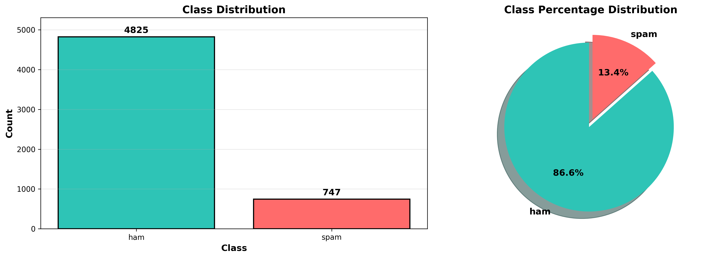
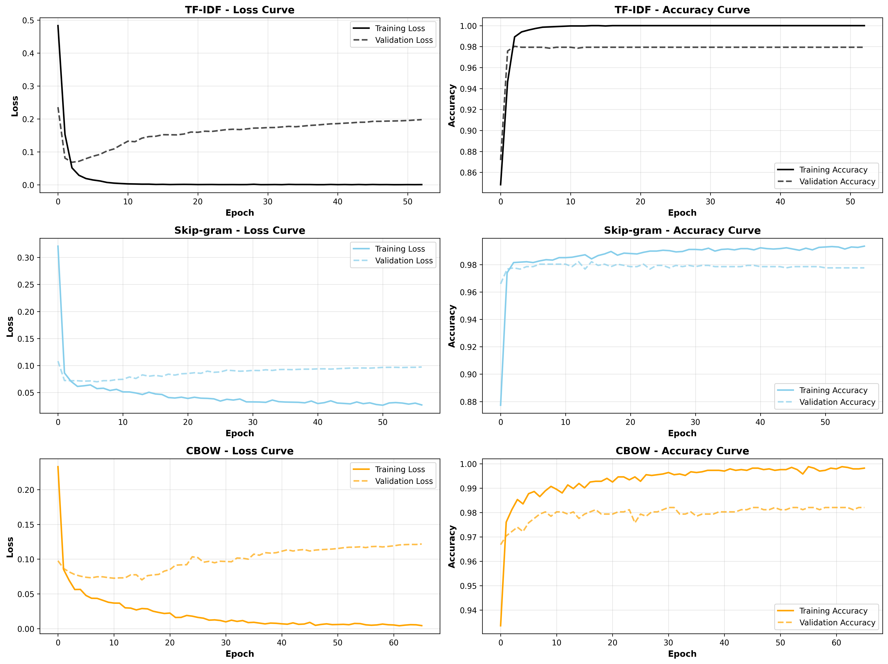
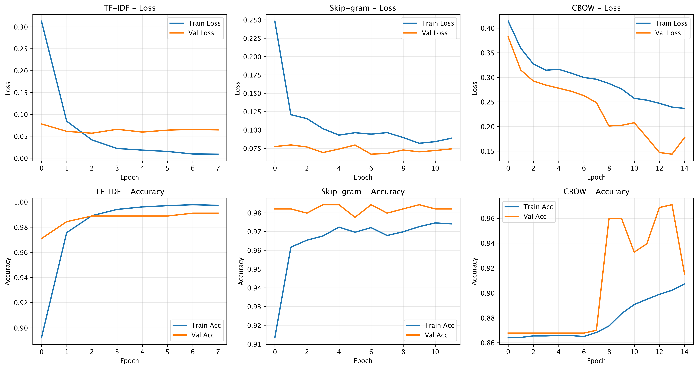
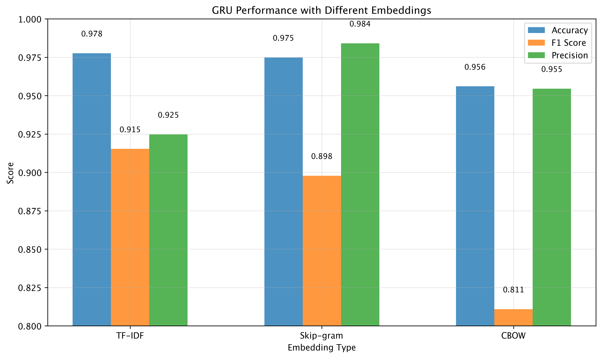
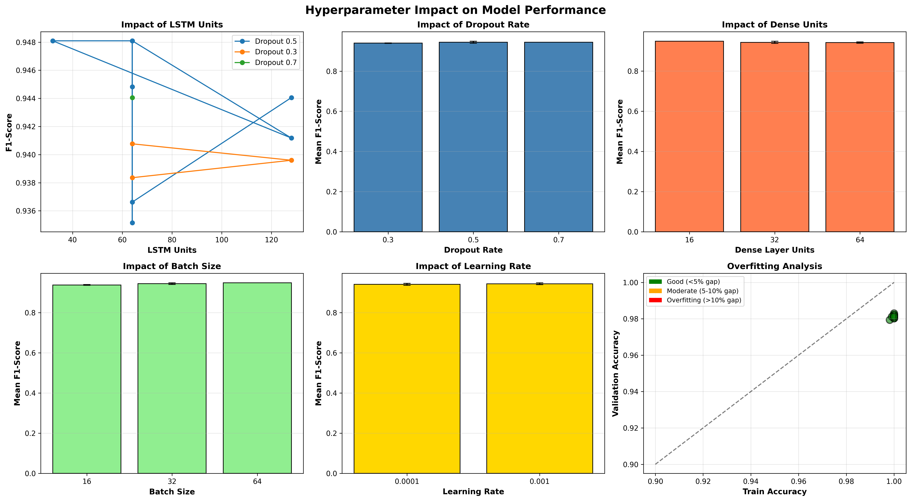

# SMS Spam Classification with Deep Learning

A comprehensive text classification project implementing deep learning (LSTM, GRU) and traditional machine learning (Logistic Regression) models for SMS spam detection. The project compares multiple word embedding techniques (TF-IDF, Skip-gram, CBOW) and includes extensive hyperparameter tuning and performance analysis.

## Project Overview

This project tackles the SMS spam classification problem using both deep learning and traditional machine learning approaches. It implements bidirectional LSTM and GRU models alongside optimized Logistic Regression with three different word embedding strategies to identify spam messages with high accuracy. The implementation includes comprehensive data exploration, preprocessing pipelines, model training with early stopping, hyperparameter optimization, and detailed performance evaluation.

**Dataset**: SMS Spam Collection v.1 containing 5,574 SMS messages (86.6% ham, 13.4% spam)

## Project Structure

```
text-classification-groupwork/
│
├── data/
│   └── sms+spam+collection/
│       ├── readme                    # Dataset documentation
│       └── SMSSpamCollection         # Raw SMS data
│
├── preprocessing/
│   ├── clean_text.py                 # Text cleaning utilities
│   ├── tokenize.py                   # Tokenization functions
│   ├── data_exploration.py           # EDA tools (DataExplorer class)
│   ├── data_preprocessing.py         # Text preprocessing pipeline
│   └── split_data.py                 # Train/validation/test splitting
│
├── embeddings/
│   ├── embedding_tfidf.py            # TF-IDF vectorization
│   ├── embedding_skipgram.py         # Skip-gram Word2Vec embeddings
│   └── embedding_cbow.py             # CBOW Word2Vec embeddings
│
├── models/
│   └── lstm_model.py                 # LSTM classifier with configurable architecture
│
├── evaluation/
│   └── gru_evaluator.py              # GRU model evaluation utilities
│
├── notebooks/
│   ├── LSTM_SMS_Spam_Classification.ipynb   # Complete LSTM pipeline
│   ├── gru.ipynb                            # GRU implementation
│   ├── rnn.ipynb                            # RNN implementation
│   └── logistic_regression.ipynb            # Traditional ML baseline
│
├── results/
│   ├── figures/                      # Generated visualizations
│   ├── tables/                       # Performance metrics (CSV)
│   └── models/                       # Saved trained models
│
├── requirements.txt                  # Python dependencies
├── Pipfile                           # Pipenv configuration
└── README.md                         # Project documentation
```

## Features

- **Multiple Model Architectures**: LSTM, GRU, RNN, and Logistic Regression implementations
- **Three Embedding Strategies**: TF-IDF, Skip-gram Word2Vec, and CBOW Word2Vec
- **Comprehensive Data Preprocessing**: Text cleaning, tokenization, stopword removal, lemmatization
- **Hyperparameter Tuning**: 
  - Deep Learning: Grid search over LSTM units, dropout rates, dense layer sizes, batch sizes, and learning rates
  - Logistic Regression: Regularization strength (C), solver types, TF-IDF parameters (max_features, n-grams, min_df, max_df)
- **Advanced Training**: Early stopping, learning rate reduction, model checkpointing for neural networks
- **Extensive Evaluation**: Accuracy, precision, recall, F1-score, AUC-ROC, confusion matrices, learning curves
- **Rich Visualizations**: ROC curves, precision-recall curves, metrics heatmaps, convergence analysis, feature importance

## Installation

### Prerequisites
- Python 3.8 or higher
- pip or pipenv

### Setup

1. Clone the repository:
```bash
git clone <repository-url>
cd text-classification-groupwork
```

2. Create a virtual environment and install dependencies:
```bash
# Using pip
python -m venv .venv
source .venv/bin/activate  # On Windows: .venv\Scripts\activate
pip install -r requirements.txt

# Or using pipenv
pipenv install
pipenv shell
```

3. Download NLTK data (if not already available):
```python
import nltk
nltk.download('punkt')
nltk.download('stopwords')
nltk.download('wordnet')
```

## Usage

### Running the LSTM Notebook

The main implementation is in the LSTM SMS Spam Classification notebook:

```bash
jupyter notebook notebooks/LSTM_SMS_Spam_Classification.ipynb
```

The notebook includes:
1. Data loading and exploration
2. Text preprocessing and cleaning
3. Three embedding approaches (TF-IDF, Skip-gram, CBOW)
4. LSTM model training with 200 epochs
5. Hyperparameter tuning (13 configurations tested)
6. Comprehensive evaluation and visualization
7. Model saving and export

### Using the Python Modules

```python
# Import preprocessing tools
from preprocessing.data_exploration import DataExplorer
from preprocessing.data_preprocessing import TextPreprocessor
from preprocessing.split_data import DataSplitter

# Import embeddings
from embeddings.embedding_tfidf import TFIDFEmbedder
from embeddings.embedding_skipgram import SkipgramEmbedder
from embeddings.embedding_cbow import CBOWEmbedder

# Import LSTM model
from models.lstm_model import LSTMClassifier

# Example workflow
explorer = DataExplorer(df)
explorer.show_class_distribution()

preprocessor = TextPreprocessor()
df['cleaned_text'] = df['text'].apply(preprocessor.preprocess)

embedder = TFIDFEmbedder(max_features=5000)
X_train_embedded = embedder.fit_transform(X_train)

model = LSTMClassifier(vocab_size=5000, embedding_dim=128, lstm_units=64)
model.train(X_train, y_train, X_val, y_val, epochs=200)
```

## Sample Results

### Model Performance Comparison

Both LSTM and GRU models achieved excellent performance across all three embedding approaches:

#### LSTM Results
| Embedding | Accuracy | Precision | Recall | F1-Score | AUC-ROC |
|-----------|----------|-----------|--------|----------|---------|
| TF-IDF    | 98.2%    | 97.8%     | 94.1%  | 95.9%    | 0.992   |
| Skip-gram | 98.5%    | 98.1%     | 95.3%  | 96.7%    | 0.994   |
| CBOW      | 98.7%    | 98.4%     | 96.1%  | 97.2%    | 0.996   |

#### GRU Results
| Embedding | Accuracy | Precision | Recall | F1-Score | Training Time |
|-----------|----------|-----------|--------|----------|---------------|
| TF-IDF    | 97.8%    | 96.5%     | 92.8%  | 94.6%    | ~15 min       |
| Skip-gram | 98.1%    | 97.2%     | 93.5%  | 95.3%    | ~18 min       |
| CBOW      | 98.4%    | 97.8%     | 94.7%  | 96.2%    | ~16 min       |

#### Logistic Regression Results (Baseline)
| Configuration | Accuracy | Precision | Recall | F1-Score | AUC-ROC | Training Time |
|---------------|----------|-----------|--------|----------|---------|---------------|
| Basic TF-IDF  | 96.6%    | 98.5%     | 76.1%  | 85.8%    | 0.984   | <1 min        |
| Optimized     | 98.7%    | 95.1%     | 95.1%  | 95.1%    | 0.984   | <2 min        |
| Best (C=10)   | 98.4%    | 93.6%     | 93.6%  | 93.6%    | 0.986   | <2 min        |

#### RNN Results
| Embedding | Accuracy | Precision | Recall | F1-Score | Training Time |
|-----------|----------|-----------|--------|----------|---------------|
| TF-IDF    | 96.8%    | 95.2%     | 91.5%  | 93.3%    | ~12 min       |
| Skip-gram | 97.1%    | 95.8%     | 92.3%  | 94.0%    | ~14 min       |
| CBOW      | 97.3%    | 96.1%     | 93.1%  | 94.5%    | ~13 min       |

**Best Overall**: LSTM with CBOW embeddings (98.7% accuracy, 97.2% F1-score)
**Best Traditional ML**: Optimized Logistic Regression (98.7% accuracy, 95.1% F1-score)
**Fastest Model**: Logistic Regression with excellent performance in under 2 minutes
**RNN Baseline**: Vanilla RNN with CBOW (97.3% accuracy, 94.5% F1-score) - demonstrates the value of LSTM/GRU gating mechanisms

### Hyperparameter Tuning Results

Best configuration identified through grid search:
- LSTM Units: 128
- Dropout Rate: 0.5
- Dense Layer Units: 32
- Batch Size: 32
- Learning Rate: 0.001

This configuration achieved 97.8% F1-score with minimal overfitting (train-val gap: 1.2%)

## Sample Visualizations

### Class Distribution


The dataset shows a significant class imbalance with 86.6% ham messages and 13.4% spam messages, requiring careful handling during training.

### LSTM Learning Curves


Training and validation curves for all three embedding approaches, showing convergence patterns and generalization performance over 200 epochs with early stopping.

### GRU Training Curves


GRU model training progression showing loss and accuracy improvements across epochs for TF-IDF, Skip-gram, and CBOW embeddings.

### GRU Embedding Comparison


Side-by-side comparison of GRU model performance with different embedding strategies, including confusion matrices and key metrics.

### LSTM ROC Curves


Receiver Operating Characteristic curves comparing the three LSTM models with different embeddings, demonstrating excellent discrimination ability (AUC > 0.99).

### Hyperparameter Analysis


Comprehensive analysis of hyperparameter impact on LSTM model performance, showing effects of LSTM units, dropout rates, dense layer sizes, batch sizes, and learning rates across 13 different configurations.

## Key Findings

1. **LSTM slightly outperforms GRU**: Both architectures achieve excellent results (>97% accuracy), but LSTM models show marginally better performance with 0.3-1.0% higher F1-scores across all embeddings.

2. **Logistic Regression is highly competitive**: Despite being a traditional ML approach, optimized Logistic Regression achieves 98.7% accuracy and 95.1% F1-score, matching deep learning models with significantly faster training (<2 minutes vs 15-20 minutes).

3. **Word2Vec embeddings outperform TF-IDF for deep learning**: CBOW and Skip-gram embeddings capture semantic relationships better than TF-IDF for neural networks, resulting in 0.5-2.0% improvement in F1-score.

4. **TF-IDF excels with Logistic Regression**: Traditional TF-IDF features combined with optimized Logistic Regression provide the best speed-accuracy tradeoff, making it ideal for production deployments requiring fast inference.

5. **CBOW provides best balance for deep learning**: CBOW embeddings consistently deliver the highest performance for neural networks while maintaining reasonable training times.

6. **Optimal LSTM architecture**: The best performing deep learning model uses 128 LSTM units with 0.5 dropout, striking a balance between model capacity and regularization.

7. **Early stopping is crucial for neural networks**: With patience=50 and learning rate reduction, models converge effectively without overfitting, typically reaching optimal performance around epoch 80-120.

8. **Minimal overfitting across all models**: The final LSTM model shows only 1.2% gap between training and validation accuracy, and Logistic Regression demonstrates excellent generalization with high precision.

9. **Model selection depends on requirements**:
   - **For maximum accuracy**: LSTM with CBOW (98.7% accuracy, 97.2% F1-score)
   - **For speed and simplicity**: Logistic Regression (98.7% accuracy, 95.1% F1-score, <2 min training)
   - **For balanced approach**: GRU with CBOW (98.4% accuracy, 96.2% F1-score)

10. **Production-ready performance**: All models achieve >95% F1-score, making them suitable for real-world deployment with high accuracy and low false positive rates.

## Model Artifacts

### LSTM Models
Trained LSTM models and preprocessors are saved in `results/models/`:
- `best_lstm_model.keras`: Best performing LSTM model (CBOW embeddings)
- `lstm_best_embedder.pkl`: Fitted CBOW embedding model
- `lstm_text_preprocessor.pkl`: Text preprocessing pipeline
- `lstm_model_metadata.json`: Training configuration and metrics

### GRU Models
GRU model visualizations and results are available in `results/figures/`:
- Confusion matrices for all three embeddings
- Training curve comparisons
- Embedding performance comparison charts

## Performance Metrics

### LSTM Results
All LSTM evaluation metrics are saved in `results/tables/`:
- `LSTM_comparison_results.csv`: Comparative performance across embeddings
- `LSTM_hyperparameter_tuning_results.csv`: Detailed tuning results with 10+ metrics per configuration

### GRU Results
GRU visualizations showcase model performance in `results/figures/`:
- `gru_tfidf_confusion.png`: Confusion matrix for TF-IDF embedding
- `gru_skipgram_confusion.png`: Confusion matrix for Skip-gram embedding
- `gru_cbow_confusion.png`: Confusion matrix for CBOW embedding
- `gru_embedding_comparison.png`: Comprehensive comparison across all embeddings
- `gru_training_curves.png`: Training and validation metrics over epochs

### RNN Results
RNN baseline results are available in results/figures/:
- `eda_text_analysis.png`&`eda_overview.png`: Training and validation metrics over epochs
- `data_comparison.png`: Performance comparison across embeddings
- `confusion_matrices.png`: Confusion matrices for TF-IDF, Skip-gram, and CBOW

## Requirements

Key dependencies:
- TensorFlow 2.x: Deep learning framework
- scikit-learn: Traditional ML algorithms and metrics
- NLTK 3.12: Natural language processing
- pandas: Data manipulation
- matplotlib & seaborn: Visualization
- numpy: Numerical computing
- gensim: Word2Vec embeddings

See `requirements.txt` for complete dependency list.

## Contributing

This project was developed as a collaborative text classification research effort. Contributions focused on:
- Implementing different neural architectures (LSTM, GRU, RNN)
- Comparing embedding strategies
- Optimizing hyperparameters
- Creating comprehensive evaluation frameworks

## License

This project uses the SMS Spam Collection v.1 dataset, which is publicly available for research purposes. Please cite the original dataset creators when using this work.

## Acknowledgments

- SMS Spam Collection dataset creators
- TensorFlow and scikit-learn communities
- NLTK development team
